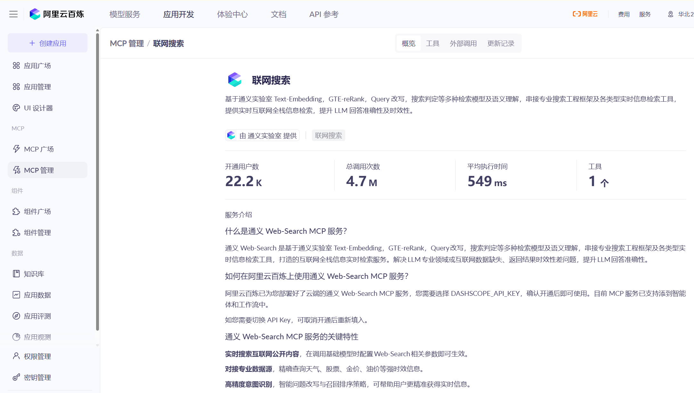
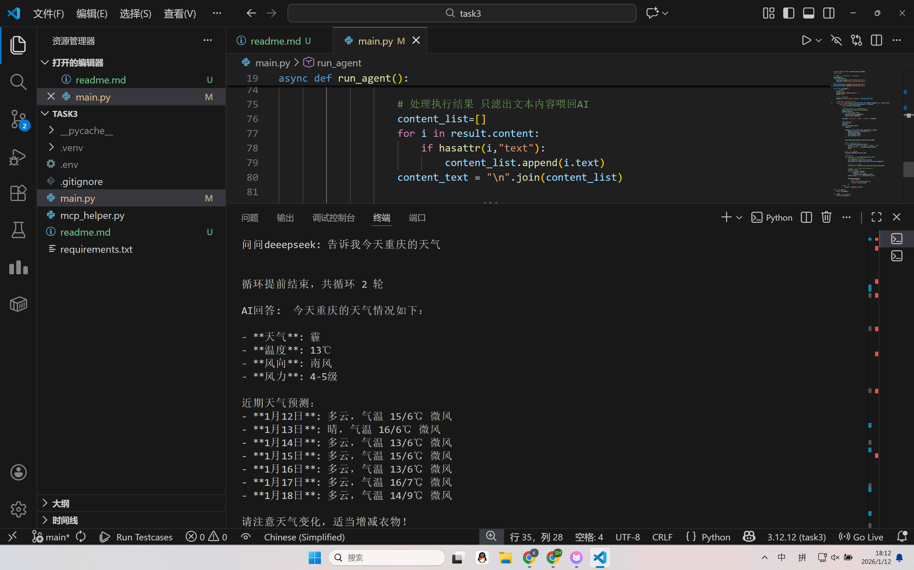
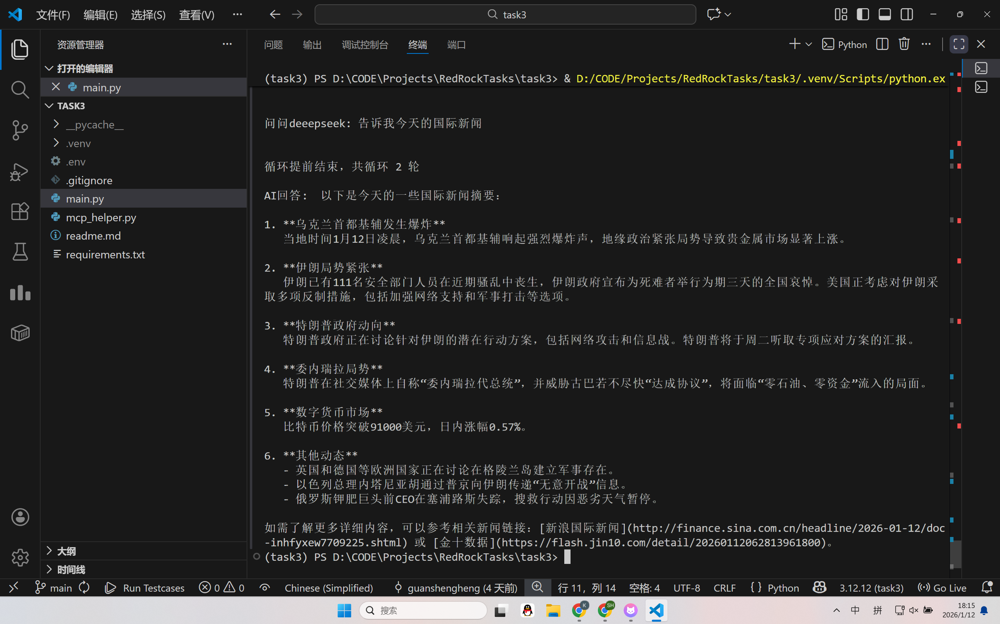

代码托管在github上，地址是[task3](https://github.com/shannonkwan86/task3)
## 开发思路
选取阿里云百炼的联网搜索MCP 使得大模型可以联网搜索

开发思路是通过LLM自己判断是否要进行调用MCP工具解答用户的问题，不调用工具就输出并结束。
具体而言是以下步骤。首先配置并连接，用sseclient接收百炼mcp服务器的数据，接收到的mcp工具编写函数转换成openai的格式。十轮循环保证执行次数够用。每次调用llm判断是否需要调用工具，不需要就输出并结束循环，需要就先把本轮的存进历史，根据本轮模型的生成解析指令，进行diao'yong

