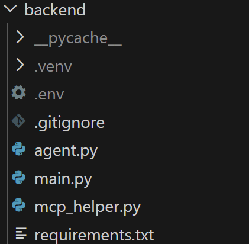

## 项目地址
代码放在github的仓库里[Task4](https://github.com/shannonkwan86/task4)

## 开发思路
大致思路就是把Task3里的cli项目借助前后端框架做成了简陋的web应用，然后我用docker打包镜像，并放到了我的阿里云服务器上。

## 开发过程

### 后端部分

文件结构如图

使用fastapi框架。Task3中是直接在命令行中输入输出，现在改成通过前端读取用户输入，输出也是以json返回给前端。
agent.py作为service层，是Task3中的main.py，几乎没做修改，只将prompt作为参数传递进函数。
main.py作为controller层，cors跨域接受前端请求，pydantic模型解析json得到str类型的prompt传给agent.py，返回响应结果。

## 前端部分
