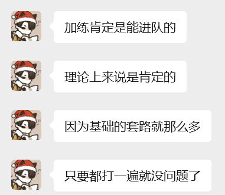

进入大学、接触算法也是接近三个学期了。临近期末和校赛，忙里偷闲，写一写近期的总结和下一步的规划。
我目前cf的rating是1300，题数一百多，实在是懈怠，训练太少，提升缓慢。看题解、AI这些内容，会减少自己的思考，导致自己没太大长进。我计划后面的做题，但凡有一点想法，就继续尝试思考。题解这种东西，留给烦躁的时候、因其他因素停止做题的时候或者毫无头绪的时候再看。有文字题解，就尽量不看代码，看懂思路后关掉网页独立完成。写不出来就说明自己没有完全弄明白，是一些自己认为理所当然的细节被忽略，实则那是关键的部分。可以用伪代码整理思路，再写出正确可以AC的代码。这种看了题解才完成的题目，下次上机前再写一遍。
题量、思维量是最重要的内容，与此同时算法和数据结构这些技能也需要加点。学习经典内容，也是在学习它们中的思维。cf继续打，板刷rating+200的题目，假期也练一练abc，补一补没掌握的技能。
寒假招新再拼一把，目标是寒假结束前上青，以及进入校队。总而言之，加训！

